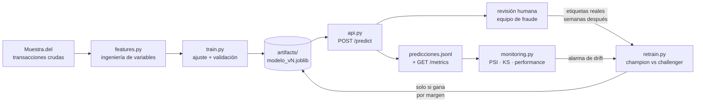

# Puesta en producción del modelo de detección de fraude

[](https://github.com/maurip3113/deteccion-fraude-mentoria/actions/workflows/ci.yml)

Este directorio toma el modelo que quedó entrenado en los notebooks del proyecto y lo convierte en un servicio: un artefacto versionado, una API que lo consulta en tiempo real, un chequeo de *drift* y un ciclo de reentrenamiento que decide si conviene reemplazarlo.

La razón de que exista es que un modelo de riesgo no se entrega una vez. La parte difícil no es alcanzar un F1 aceptable en un notebook — es sostenerlo cuando los datos que llegan dejan de parecerse a los del entrenamiento. Los notebooks del proyecto llegan hasta el modelo entrenado; acá empieza lo que viene después.

## El ciclo de vida



El lazo que importa es el de abajo: las etiquetas reales de fraude no existen en el momento de la transacción, llegan semanas después vía contracargo o reclamo. Todo el diseño está condicionado por eso.

## Cómo correrlo

```bash
cd produccion
pip install -r requirements.txt
```

```bash
python -m fraude.train
```
Reconstruye el histórico, entrena y deja `artifacts/modelo_v1.joblib` con su metadata.

```bash
uvicorn fraude.api:app --reload
```
Levanta la API en `http://localhost:8000` — documentación interactiva en `/docs`.

```bash
curl -X POST http://localhost:8000/predict -H "Content-Type: application/json" -d '{"cliente_id":101,"trx_timestamp":"2025-12-24T03:47:00","trx_importe":185000.0,"trx_moneda":1,"trx_rubro_red":5311,"trx_tipo_terminal":3,"cliente_fecha_nacimiento":"1985-04-12","cliente_sexo":"MASCULINO","cliente_estado_civil":"SOLTERO/A","cliente_segmento":"S3"}'
```

```bash
python -m fraude.monitoring --demo
```
Compara diciembre contra el resto del año y reporta drift.

```bash
python -m fraude.retrain
```
Entrena un challenger con datos más recientes y decide si merece reemplazar al modelo en producción.

```bash
python -m pytest tests/ -q
```

```bash
docker build -t fraude-api . && docker run -p 8000:8000 fraude-api
```

En cada push, [el workflow de CI](../.github/workflows/ci.yml) corre los tests, construye la imagen, levanta el contenedor y comprueba que `/health`, `/predict`, `/ping` e `/invocations` respondan — así el despliegue queda verificado aunque la máquina de desarrollo no pueda correr Docker.

## Despliegue en SageMaker

La misma imagen sirve como endpoint de SageMaker: un endpoint con contenedor propio sólo exige exponer `GET /ping` y `POST /invocations`, y escuchar en el puerto 8080. Ambas rutas están en [`api.py`](fraude/api.py) reusando la app existente.

**Por qué contenedor propio y no el contenedor gestionado de XGBoost.** El contenedor que AWS provee para XGBoost espera recibir el vector de features ya armado. Pero acá el trabajo difícil está justo antes: `Cliente_Trx_Count`, `Tiempo_Entre_Trx_Horas` y `Desvio_Importe_Cliente_Abs` dependen del historial del cliente, no de la transacción. Usar el contenedor gestionado obligaría a reimplementar esa lógica del lado del cliente y a mantener dos copias en sincronía — exactamente el *training/serving skew* que [`features.py`](fraude/features.py) existe para evitar. Traer el contenedor propio cuesta un `docker push` y elimina el problema.

Los scripts de despliegue necesitan `pip install boto3`, que a propósito no está en `requirements.txt`: son herramientas de operación y no tienen por qué viajar dentro de la imagen que sirve el modelo.

```bash
# 1. Publicar la imagen en ECR
aws ecr create-repository --repository-name deteccion-fraude
aws ecr get-login-password --region us-east-1 \
  | docker login --username AWS --password-stdin <cuenta>.dkr.ecr.us-east-1.amazonaws.com
docker build -t deteccion-fraude .
docker tag deteccion-fraude:latest <cuenta>.dkr.ecr.us-east-1.amazonaws.com/deteccion-fraude:v1
docker push <cuenta>.dkr.ecr.us-east-1.amazonaws.com/deteccion-fraude:v1
```

```bash
# 2. Crear el endpoint serverless
python -m aws.deploy --rol arn:aws:iam::<cuenta>:role/<rol-sagemaker> \
                     --imagen <cuenta>.dkr.ecr.us-east-1.amazonaws.com/deteccion-fraude:v1
```

```bash
# 3. Verificar que discrimine, no sólo que responda
python -m aws.invoke --region us-east-1
```

```bash
# 4. Borrarlo al terminar
python -m aws.deploy --borrar
```

El rol de ejecución necesita `AmazonSageMakerFullAccess` y permiso de lectura sobre el repositorio de ECR. Se eligió **serverless** porque este endpoint recibiría tráfico esporádico: no hay costo por hora mientras nadie lo invoca, a cambio de latencia de arranque en frío. Un endpoint *real-time* tiene sentido recién con tráfico sostenido, donde el arranque en frío deja de amortizarse. Conviene mirar la calculadora de precios de AWS antes de crear nada, y borrar el endpoint al terminar.

**Una diferencia deliberada con el servicio local:** `/invocations` no actualiza el estado del cliente, mientras que `/predict` sí. Un endpoint corre en varias réplicas que no comparten memoria y se reciclan solas, así que un acumulado en RAM daría respuestas distintas según qué réplica atienda y se perdería en cada arranque en frío. El estado se usa de sólo lectura, tal como quedó al entrenar. Resolverlo de verdad es moverlo a DynamoDB o a un feature store — el pendiente principal de la lista de abajo.

## Decisiones de diseño

**Un solo lugar define las variables.** `features.py` lo usan tanto el entrenamiento como la API. Si cada camino armara las features por su cuenta, el modelo vería en producción una distribución distinta a la que aprendió — *training/serving skew*, la falla más común y más silenciosa al desplegar. El test `test_estado_del_cliente_replica_la_ventana_expansiva` compara el cálculo online contra el de pandas justamente para que esa equivalencia no se rompa sin que nadie lo note.

**La API necesita memoria del cliente.** Tres de las 23 variables (`Cliente_Trx_Count`, `Tiempo_Entre_Trx_Horas`, `Desvio_Importe_Cliente_Abs`) no se pueden calcular mirando sólo la transacción que llega: dependen de todo lo que el cliente hizo antes. En un banco eso vive en un *feature store*; acá lo resuelve `EstadoClientes`, que mantiene media y varianza corrientes con el algoritmo de Welford y reproduce exactamente la ventana expansiva del TP2 sin guardar el histórico completo en memoria.

**El umbral se elige en validación, no en evaluación.** Los notebooks eligen el umbral que maximiza F1 mirando el conjunto de test, y después reportan el F1 sobre ese mismo conjunto. Eso infla el número: el umbral ya vio los datos con los que se lo mide. Acá el histórico se parte en tres — entrenamiento, validación y evaluación — y el umbral sale de validación.

**Alertar no es bloquear.** La respuesta de `/predict` incluye una acción (`revision_humana` / `aprobar`), no un bloqueo. Con una precisión del 66%, bloquear automáticamente significa frenar una transacción legítima de cada tres alertas.

**El artefacto declara con qué versiones se entrenó.** `joblib` guarda referencias a las clases de la librería que creó el modelo: cargar en el contenedor un `.joblib` serializado con otra versión de scikit-learn o xgboost falla, o —peor— funciona devolviendo predicciones sutilmente distintas a las que se validaron. Cada modelo guarda su `entorno` y la API lo compara al arrancar. `requirements.txt` está fijado a esas versiones exactas, y al reentrenar con librerías nuevas hay que actualizarlo en el mismo commit.

**Reemplazar el modelo exige ganar por un margen.** `retrain.py` promueve el challenger sólo si mejora el F1 en más de 0,01. Cambiar el modelo tiene un costo operativo — revalidación, aviso al equipo de fraude, recalibración de umbrales — que una diferencia del tamaño del ruido no justifica.

**La partición del reentrenamiento es temporal, no aleatoria.** Con partición aleatoria el reentrenamiento siempre parece funcionar, porque entrenamiento y evaluación comparten el mismo período. El punto de reentrenar es responder a que el mundo cambió con el tiempo, y eso sólo se ve evaluando hacia adelante.

## Lo que apareció al hacer esto

**El F1 del proyecto estaba optimista, por dos motivos independientes.** Con el umbral elegido en validación en vez de en test, el F1 de evaluación queda en **0,601** (precisión 0,66 / recall 0,55 / AUC-PR 0,620), contra el 0,653 que reportan los notebooks. Parte de esa diferencia es el umbral; la otra parte es más seria y aparece abajo.

**El fraude de este dataset está concentrado al final del año.**

| Mes | ene–ago | sep | oct | nov | dic |
|---|---|---|---|---|---|
| Tasa de fraude | 0,05 % | 0,10 % | 0,25 % | 1,28 % | 6,22 % |

De los 1.196 fraudes del año, 1.076 caen en noviembre y diciembre. Una partición aleatoria le permite al modelo entrenar con fraude de diciembre y después evaluarse contra fraude de diciembre — que es exactamente lo que nunca va a poder hacer en producción.

El mismo análisis, hecho sobre el Random Forest y con gráficos, está en la sección 5.3 del [notebook de mejoras](../Mejoras_Modelo_y_Produccion.ipynb).

**Evaluado como se lo usaría de verdad, el modelo rinde mucho menos.** Entrenando con enero–agosto y evaluando sobre noviembre–diciembre, el F1 cae de 0,601 a **0,145**. Y agregarle septiembre–octubre al entrenamiento lo empeora todavía más en F1 (0,032) aunque le mejore el AUC-PR (+0,027).

**Esa contradicción es el hallazgo central.** El AUC-PR sube — el modelo ordena *mejor* las transacciones por riesgo — mientras el F1 se desploma. La diferencia entera está en el umbral: con el umbral óptimo del propio período, el mismo challenger daría 0,274 en vez de 0,032. Es decir, **pierde 0,242 de F1 sólo por tener un umbral calibrado contra una tasa base veinte veces menor a la que enfrenta**.

La conclusión operativa no es "reentrenar más seguido". Es que el umbral no puede ser una constante estimada una vez: tiene que re-derivarse periódicamente, y en un caso como diciembre — donde `monitoring.py` detecta que el volumen de alertas se multiplica por 24,65 — la restricción real que manda no es el F1 histórico sino cuántos casos por día puede revisar el equipo de fraude.

## Lo que falta para que esto sea producción de verdad

Vale la pena ser explícito sobre el límite de este ejercicio:

- **El estado de clientes vive en memoria del proceso.** Se reinicia con el servicio y no se comparte entre réplicas — por eso `/invocations` lo usa de sólo lectura. Es el pendiente más importante: en producción va a DynamoDB, Redis o un feature store gestionado, y recién ahí el endpoint puede incorporar la transacción que acaba de puntuar al historial del cliente.
- **No hay autenticación, rate limiting ni trazas distribuidas.** En SageMaker la autenticación la resuelve IAM, pero un consumidor externo necesitaría API Gateway adelante.
- **El despliegue está escrito y verificado, pero nunca ejecutado contra AWS.** `aws/deploy.py` crea el endpoint y `aws/invoke.py` lo prueba; el contenedor cumple el contrato de SageMaker y el CI lo comprueba en cada push, pero nadie corrió todavía el `docker push` a ECR ni pagó por un endpoint.
- **El reentrenamiento se dispara a mano.** Automatizarlo es un scheduler (EventBridge → SageMaker Pipeline o Step Functions), no un cambio de lógica.
- **No hay registro formal de modelos.** `modelo_actual.txt` alcanza para un proyecto; en producción es SageMaker Model Registry o MLflow, con aprobación explícita para promover.
- **El monitoreo escribe reportes, no dispara alertas.** Falta publicar las métricas a CloudWatch y conectar los umbrales de PSI a una notificación real.

## Estructura

```
produccion/
├── fraude/
│   ├── features.py     # ingeniería de variables compartida + estado por cliente
│   ├── train.py        # entrenamiento, validación y serialización versionada
│   ├── api.py          # servicio FastAPI de scoring
│   ├── monitoring.py   # PSI, KS y performance con etiquetas reales
│   └── retrain.py      # champion/challenger con partición temporal
├── aws/
│   ├── deploy.py       # crea el endpoint serverless de SageMaker
│   └── invoke.py       # verificación post-despliegue
├── artifacts/          # modelos versionados, metadata y logs
├── tests/
├── Dockerfile
├── entrypoint.sh
└── requirements.txt
```
