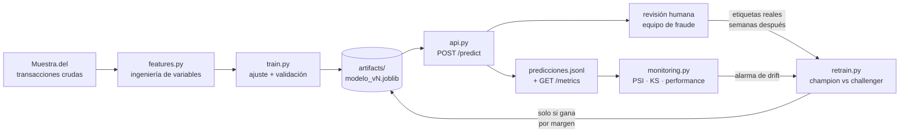

# Puesta en producción del modelo de detección de fraude

[](https://github.com/maurip3113/deteccion-fraude-mentoria/actions/workflows/ci.yml)

Este directorio toma el modelo que quedó entrenado en los notebooks del proyecto y lo convierte en un servicio: un artefacto versionado, una API que lo consulta en tiempo real, un chequeo de *drift* y un ciclo de reentrenamiento que decide si conviene reemplazarlo.

La razón de que exista es que un modelo de riesgo no se entrega una vez. La parte difícil no es alcanzar un F1 aceptable en un notebook — es sostenerlo cuando los datos que llegan dejan de parecerse a los del entrenamiento. Los notebooks del proyecto llegan hasta el modelo entrenado; acá empieza lo que viene después.

## El ciclo de vida



El lazo que importa es el de abajo: las etiquetas reales de fraude no existen en el momento de la transacción, llegan semanas después vía contracargo o reclamo. Todo el diseño está condicionado por eso.

## Cómo correrlo

```bash
cd produccion
pip install -r requirements.txt
```

```bash
python -m fraude.train
```
Reconstruye el histórico, entrena y deja `artifacts/modelo_v1.joblib` con su metadata.

```bash
uvicorn fraude.api:app --reload
```
Levanta la API en `http://localhost:8000` — documentación interactiva en `/docs`.

```bash
curl -X POST http://localhost:8000/predict -H "Content-Type: application/json" -d '{"cliente_id":101,"trx_timestamp":"2025-12-24T03:47:00","trx_importe":185000.0,"trx_moneda":1,"trx_rubro_red":5311,"trx_tipo_terminal":3,"cliente_fecha_nacimiento":"1985-04-12","cliente_sexo":"MASCULINO","cliente_estado_civil":"SOLTERO/A","cliente_segmento":"S3"}'
```

```bash
python -m fraude.monitoring --demo
```
Compara diciembre contra el resto del año y reporta drift.

```bash
python -m fraude.dashboard
```
Convierte ese reporte en `artifacts/dashboard.html`: el JSON es para que lo consuma otro proceso, el tablero es para que una persona vea en cinco segundos si algo se movió y qué. Está ordenado por lo que decide una acción — primero el volumen de alertas, que es lo que satura al equipo de fraude, y recién después el detalle por variable.

```bash
python -m fraude.retrain
```
Entrena un challenger con datos más recientes y decide si merece reemplazar al modelo en producción.

```bash
python -m pytest tests/ -q
```

```bash
docker build -t fraude-api . && docker run -p 8000:8000 fraude-api
```

En cada push, [el workflow de CI](../.github/workflows/ci.yml) corre los tests, construye la imagen, levanta el contenedor y comprueba que `/health`, `/predict`, `/ping` e `/invocations` respondan — así el despliegue queda verificado aunque la máquina de desarrollo no pueda correr Docker.

## Despliegue en SageMaker

La misma imagen sirve como endpoint de SageMaker: un endpoint con contenedor propio sólo exige exponer `GET /ping` y `POST /invocations`, y escuchar en el puerto 8080. Ambas rutas están en [`api.py`](fraude/api.py) reusando la app existente.

**Por qué contenedor propio y no el contenedor gestionado de XGBoost.** El contenedor que AWS provee para XGBoost espera recibir el vector de features ya armado. Pero acá el trabajo difícil está justo antes: `Cliente_Trx_Count`, `Tiempo_Entre_Trx_Horas` y `Desvio_Importe_Cliente_Abs` dependen del historial del cliente, no de la transacción. Usar el contenedor gestionado obligaría a reimplementar esa lógica del lado del cliente y a mantener dos copias en sincronía — exactamente el *training/serving skew* que [`features.py`](fraude/features.py) existe para evitar. Traer el contenedor propio cuesta un `docker push` y elimina el problema.

Los scripts de despliegue necesitan `pip install boto3`, que a propósito no está en `requirements.txt`: son herramientas de operación y no tienen por qué viajar dentro de la imagen que sirve el modelo.

```bash
# 1. Publicar la imagen en ECR
aws ecr create-repository --repository-name deteccion-fraude
aws ecr get-login-password --region us-east-1 \
  | docker login --username AWS --password-stdin <cuenta>.dkr.ecr.us-east-1.amazonaws.com
docker build -t deteccion-fraude .
docker tag deteccion-fraude:latest <cuenta>.dkr.ecr.us-east-1.amazonaws.com/deteccion-fraude:v1
docker push <cuenta>.dkr.ecr.us-east-1.amazonaws.com/deteccion-fraude:v1
```

```bash
# 2. Crear el endpoint serverless
python -m aws.deploy --rol arn:aws:iam::<cuenta>:role/<rol-sagemaker> \
                     --imagen <cuenta>.dkr.ecr.us-east-1.amazonaws.com/deteccion-fraude:v1
```

```bash
# 3. Verificar que discrimine, no sólo que responda
python -m aws.invoke --region us-east-1
```

```bash
# 4. Borrarlo al terminar
python -m aws.deploy --borrar
```

El rol de ejecución necesita `AmazonSageMakerFullAccess` y permiso de lectura sobre el repositorio de ECR. Se eligió **serverless** porque este endpoint recibiría tráfico esporádico: no hay costo por hora mientras nadie lo invoca, a cambio de latencia de arranque en frío. Un endpoint *real-time* tiene sentido recién con tráfico sostenido, donde el arranque en frío deja de amortizarse. Conviene mirar la calculadora de precios de AWS antes de crear nada, y borrar el endpoint al terminar.

**Una diferencia deliberada con el servicio local:** `/invocations` no actualiza el estado del cliente, mientras que `/predict` sí. Un endpoint corre en varias réplicas que no comparten memoria y se reciclan solas, así que un acumulado en RAM daría respuestas distintas según qué réplica atienda y se perdería en cada arranque en frío. El estado se usa de sólo lectura, tal como quedó al entrenar. Resolverlo de verdad es moverlo a DynamoDB o a un feature store — el pendiente principal de la lista de abajo.

## Decisiones de diseño

**Un solo lugar define las variables.** `features.py` lo usan tanto el entrenamiento como la API. Si cada camino armara las features por su cuenta, el modelo vería en producción una distribución distinta a la que aprendió — *training/serving skew*, la falla más común y más silenciosa al desplegar. El test `test_estado_del_cliente_replica_la_ventana_expansiva` compara el cálculo online contra el de pandas justamente para que esa equivalencia no se rompa sin que nadie lo note.

**La API necesita memoria del cliente.** Tres de las 23 variables (`Cliente_Trx_Count`, `Tiempo_Entre_Trx_Horas`, `Desvio_Importe_Cliente_Abs`) no se pueden calcular mirando sólo la transacción que llega: dependen de todo lo que el cliente hizo antes. En un banco eso vive en un *feature store*; acá lo resuelve `EstadoClientes`, que mantiene media y varianza corrientes con el algoritmo de Welford y reproduce exactamente la ventana expansiva del TP2 sin guardar el histórico completo en memoria.

**El umbral se elige en validación, no en evaluación.** Los notebooks eligen el umbral que maximiza F1 mirando el conjunto de test, y después reportan el F1 sobre ese mismo conjunto. Eso infla el número: el umbral ya vio los datos con los que se lo mide. Acá el histórico se parte en tres — entrenamiento, validación y evaluación — y el umbral sale de validación.

**Alertar no es bloquear.** La respuesta de `/predict` incluye una acción (`revision_humana` / `aprobar`), no un bloqueo. Con una precisión del 67%, bloquear automáticamente significa frenar una transacción legítima de cada tres alertas.

**Y la alerta viene con su motivo.** Si el modelo manda una transacción a revisión humana pero no dice por qué, le deja al analista el trabajo entero. Cada respuesta incluye las variables que más pesaron, con su valor y hacia dónde empujaron:

```json
"explicacion": [
  {"variable": "horas desde la transaccion anterior", "valor": 19.22, "contribucion": -1.29, "empuja": "hacia legitima"},
  {"variable": "hora del dia",                        "valor": 3.0,   "contribucion": +0.92, "empuja": "hacia fraude"},
  {"variable": "edad del cliente",                    "valor": 39.0,  "contribucion": -0.82, "empuja": "hacia legitima"}
]
```

Son valores SHAP calculados con el TreeSHAP **que ya trae XGBoost** (`pred_contribs=True`), no con el paquete `shap`: es el mismo algoritmo y el mismo resultado exacto, pero no le suma al contenedor una dependencia pesada para calcular algo que el modelo sabe hacer solo. Cuesta ~2 ms por transacción. Son exactos, no aproximados — un test verifica que `base + contribuciones` reproduce la probabilidad del modelo, porque una explicación que no se corresponde con la decisión es peor que no explicar.

Las contribuciones son aditivas en *log-odds*, no en probabilidad: no se leen como "aporta 12% de riesgo" sino como cuánto empuja cada variable en la escala en que el modelo decide.

**El artefacto declara con qué versiones se entrenó.** `joblib` guarda referencias a las clases de la librería que creó el modelo: cargar en el contenedor un `.joblib` serializado con otra versión de scikit-learn o xgboost falla, o —peor— funciona devolviendo predicciones sutilmente distintas a las que se validaron. Cada modelo guarda su `entorno` y la API lo compara al arrancar. `requirements.txt` está fijado a esas versiones exactas, y al reentrenar con librerías nuevas hay que actualizarlo en el mismo commit.

**Reemplazar el modelo exige ganar por un margen.** `retrain.py` promueve el challenger sólo si mejora el F1 en más de 0,01. Cambiar el modelo tiene un costo operativo — revalidación, aviso al equipo de fraude, recalibración de umbrales — que una diferencia del tamaño del ruido no justifica.

**Los contadores acumulados no cuentan como drift.** `Cliente_Trx_Count` es la cantidad de transacciones previas del cliente: crece con el calendario, así que en diciembre se aparta del entrenamiento (media 266 → 503, PSI 0,67) por el paso del tiempo y no porque algo haya fallado. Medirlo contra una referencia congelada produce una alarma que suena siempre, y una alarma que suena siempre deja de mirarse. Se sigue calculando su PSI —una caída repentina sí significaría algo— pero queda marcado como `estructural` y no dispara nada. Con esa corrección la alarma de diciembre sigue activándose, ahora por la razón correcta: el volumen de alertas, no un contador contando.

**La partición del reentrenamiento es temporal, no aleatoria.** Con partición aleatoria el reentrenamiento siempre parece funcionar, porque entrenamiento y evaluación comparten el mismo período. El punto de reentrenar es responder a que el mundo cambió con el tiempo, y eso sólo se ve evaluando hacia adelante.

## Lo que apareció al hacer esto

**El F1 del proyecto estaba optimista, por dos motivos independientes.** Con el umbral elegido en validación en vez de en test, el F1 de evaluación queda en **0,599** (precisión 0,67 / recall 0,54 / AUC-PR 0,632), contra el 0,653 que reportan los notebooks. Parte de esa diferencia es el umbral; la otra parte es más seria y aparece abajo.

**El fraude de este dataset está concentrado al final del año.**

| Mes | ene–ago | sep | oct | nov | dic |
|---|---|---|---|---|---|
| Tasa de fraude | 0,05 % | 0,10 % | 0,25 % | 1,28 % | 6,22 % |

De los 1.196 fraudes del año, 1.076 caen en noviembre y diciembre. Una partición aleatoria le permite al modelo entrenar con fraude de diciembre y después evaluarse contra fraude de diciembre — que es exactamente lo que nunca va a poder hacer en producción.

**Y a nivel cliente el patrón es más raro todavía.** El 49% de los clientes del dataset sufrió fraude alguna vez en el año — muy por encima de cualquier cartera real — y 315 de los 352 afectados estrenan su primer fraude en noviembre o diciembre. Con un solo año eso admite dos lecturas que no se pueden separar: un episodio real de fraude, o una muestra construida seleccionando clientes afectados en esa ventana. Si vale la segunda, el 0,62% de tasa de fraude no es el de la población, y `scale_pos_weight`, el umbral y el volumen de alertas esperado quedan calibrados contra un número que en producción no existe. Es la primera pregunta a hacerle a quien provee los datos.

El análisis completo, con gráficos y sobre el Random Forest, está en la sección 5.3 del [notebook de mejoras](../Mejoras_Modelo_y_Produccion.ipynb).

**Evaluado como se lo usaría de verdad, el modelo rinde mucho menos.** Entrenando con enero–agosto y evaluando sobre noviembre–diciembre, el F1 cae de 0,599 a **0,145**. Y agregarle septiembre–octubre al entrenamiento lo empeora todavía más en F1 (0,032) aunque le mejore el AUC-PR (+0,027).

**Esa contradicción es el hallazgo central.** El AUC-PR sube — el modelo ordena *mejor* las transacciones por riesgo — mientras el F1 se desploma. La diferencia entera está en el umbral: con el umbral óptimo del propio período, el mismo challenger daría 0,274 en vez de 0,032. Es decir, **pierde 0,242 de F1 sólo por tener un umbral calibrado contra una tasa base veinte veces menor a la que enfrenta**.

La conclusión operativa no es "reentrenar más seguido". Es que el umbral no puede ser una constante estimada una vez: tiene que re-derivarse periódicamente, y en un caso como diciembre — donde `monitoring.py` detecta que el volumen de alertas se multiplica por 24,65 — la restricción real que manda no es el F1 histórico sino cuántos casos por día puede revisar el equipo de fraude.

**Lo que apareció al auditar el modelo con SHAP.** La misma herramienta que explica una alerta sirve para revisar en qué se apoya el modelo en general (`importancia_global` en [`explain.py`](fraude/explain.py)):

| Variable | Peso |
|---|---|
| `Rubro_Categoria_TasaFraude` | 36,5 % |
| `Presencia_Cliente_Presencial` | 10,2 % |
| `Trx_Importe` | 9,4 % |
| `Cliente_Trx_Count` | 8,6 % |

Que una sola variable concentre el 37% pedía explicación, sobre todo siendo un *target encoding*. Resultó no ser fuga —el encoding se ajusta sólo con entrenamiento— sino algo más simple: **la categoría `SIN RUBRO / NO APLICA` son 103.499 transacciones, el 54% del dataset, y no tiene ni un solo fraude.** Son movimientos que no son compras con tarjeta, así que la variable está separando sobre todo "esto es una compra en un comercio" de "esto es otra cosa".

Eso tiene dos consecuencias concretas:

- **La tasa de fraude relevante es 1,34%, no 0,62%** — la del subconjunto donde el fraude es posible. Es el número que importa para dimensionar la revisión.
- **Infla `accuracy` y `AUC-ROC`, no F1 ni AUC-PR.** Restringiendo la evaluación a transacciones donde el fraude puede ocurrir, el AUC-ROC baja de 0,967 a **0,931**, mientras que F1 (0,599) y AUC-PR (0,632) no se mueven — porque no dependen de los verdaderos negativos que se quitaron. Es una confirmación de que estaba bien elegido liderar con F1 y AUC-PR.

**Y un defecto real, ya corregido:** el target encoding no estaba suavizado. `Hoteles y Alojamiento` recibía el valor de riesgo más alto de todo el mapa (**0,143**) estimado con **11 transacciones y 2 fraudes** — ruido tratado como la señal de comercio más fuerte del modelo. Ahora el encoding se suaviza hacia la tasa global en proporción a lo poco que se sabe de cada categoría, y ese valor pasa a **0,023** mientras las categorías grandes quedan intactas (`Comercio Mayorista`, 25.272 filas: 0,0030 → 0,0030).

La corrección vive sólo acá, no en los notebooks: el TP2 define el encoding sin suavizar y esa es la entrega tal como se hizo. Es una divergencia deliberada entre el pipeline del curso y el de producción, y explica por qué los números de esta carpeta no coinciden exactamente con los de los notebooks.

Vale aclarar por qué se hizo igual: **no mejora las métricas**. Probando el parámetro de suavizado en 0, 10, 50 y 200, el F1 de validación va de 0,596 a 0,623 y el de evaluación se mueve entre 0,599 y 0,635 sin un ganador claro — diferencias dentro del ruido que ya conocemos, con sólo 239 fraudes en evaluación. La justificación es **robustez, no ganancia medida**: se elimina la posibilidad de que dos casos definan la señal de comercio más fuerte del modelo. Se tomó 50 por ser el mejor en F1 de validación, sabiendo que la elección entre 10 y 200 es indistinguible con estos datos.

## Banco de pruebas: ¿el monitoreo detecta lo que debería?

Todo lo anterior monitorea. Pero **¿cómo se sabe si el monitoreo sirve?** Con un solo período real no hay forma: se ve una foto, se dice "detectó el pico de diciembre" y no queda claro si eso fue mérito o casualidad.

`simulacion/` resuelve eso generando dos años sintéticos con **cambios declarados de antemano**, y después verificando qué encontró el monitoreo.

**La trampa que evita.** Generar datos con un patrón y mostrar que el modelo lo detecta no prueba nada: el patrón lo puso uno. Por eso los escenarios viven en [`escenarios.py`](simulacion/escenarios.py) como configuración explícita, y eso permite medir las dos cosas que sí valen: **si detecta lo inyectado** y **si se calla en los meses tranquilos** — la mitad que casi nadie prueba, y la que decide si una alarma se mira o se ignora.

**Los timestamps no se inventan.** Cada año sintético es el histórico real corrido 364 días (52 semanas exactas, así que se conserva el día de la semana), con los escenarios aplicados encima. Las etiquetas de fraude sí se regeneran, desde una regla declarada construida con las tasas realmente observadas en 2025 — nunca desde el modelo, que sería circular.

```bash
python -m simulacion.generador     # dos años sintéticos con los escenarios aplicados
python -m simulacion.orquestador   # el lazo mes a mes, y la verificación final
python -m simulacion.reproductor --periodo 2026-12 --n 800   # replay contra la API
python -m simulacion.tablero        # el tablero temporal a partir de la línea de tiempo
```

El tablero de la simulación es distinto del de monitoreo: aquel muestra una foto, éste la
película. Y sobre todo **superpone lo declarado con lo detectado** sobre el mismo eje, así
que se puede trazar una vertical desde un escenario inyectado hasta la métrica que lo delató
— o ver que no lo delató ninguna.

### El resultado

Un escenario cuenta como detectado sólo si **el disparador de la alarma corresponde a su firma declarada**. Que una alarma caiga dentro de su ventana no alcanza: en agosto de 2027 se superponen dos escenarios, y atribuirle a uno el mérito del otro sería contarse un acierto que no ocurrió.

| Escenario | Detectado | Retraso | Caída de F1 |
|---|---|---|---|
| Temporada alta (dic 2026) | sí, 1/1 meses | 0 meses | — |
| Migración a e-commerce (abr–dic 2027) | sí, 3/9 meses | **4 meses** | −71 % |
| Campaña de fraude presencial (ago–sep 2027) | **invisible por diseño** | — | −73 % |
| Temporada alta (dic 2027) | sí, 1/1 meses | 0 meses | — |

**3 de 3 escenarios visibles detectados, 0 falsos positivos en 14 meses tranquilos.**

El cuarto no es una falla: la campaña presencial cambia *dónde* ocurre el fraude sin cambiar cómo se ven las transacciones. Es *concept drift* puro, el PSI no puede verlo por construcción, y el escenario lo declara de antemano (`detectable_sin_etiquetas=False`). Sí aparece cuando llegan las etiquetas — el F1 cae 73 %. Es la demostración cuantificada de por qué el monitoreo necesita las tres capas y no sólo la primera. El lazo promovió tres modelos nuevos y en diciembre de 2027 decidió mantener el vigente, porque el challenger perdió por 0,02 de F1.

El dato que importa es el retraso de **4 meses** en la migración a e-commerce. Es un drift gradual: el PSI sube de a poco (0,199 → 0,204 → 0,214 → 0,206 → 0,273) y recién cruza 0,25 al quinto mes. Un cambio abrupto se detecta el mismo mes; uno lento tarda un trimestre largo. Eso no se puede saber sin un banco de pruebas.

### Lo que apareció construyéndolo

**Tres bugs propios, encontrados porque el banco de pruebas tiene respuesta correcta conocida:**

1. **La primera versión del generador repartía los días al azar dentro del mes**, lo que destruía el espaciado entre transacciones de cada cliente. `Tiempo_Entre_Trx_Horas` marcaba drift severo los 24 meses. Peor: el lazo llegó a **reentrenar cuatro veces persiguiendo ese artefacto**, y después las alarmas cesaron porque el modelo se había adaptado a un patrón que no existía. Es exactamente lo que pasa en producción cuando el monitoreo tiene un sesgo sistemático.
2. **La regla generativa omitía el rubro**, que es el 36,5% del peso del modelo. El fraude sintético caía en `SIN RUBRO` —103.499 filas reales sin un solo fraude— y el recall del modelo se iba a cero. Corregido con las tasas observadas por categoría.
3. **La regla de alarma exigía tres variables en drift**, lo que desactivaba en la práctica el umbral PSI de 0,25. Ese corte significa justamente "una sola variable acá ya amerita mirar".

**Y un bug del servicio, que los tests no encontraron.** La reproducción en streaming falló con 422 en una transacción: el contrato exigía `importe > 0`, pero el dataset real tiene **78 transacciones de importe cero** con las que el modelo se entrenó. Las pruebas usaban importes inventados y nunca lo tocaron. Rechazarlas en serving le negaría un score a filas que el modelo sí vio entrenando.

## Lo que falta para que esto sea producción de verdad

Vale la pena ser explícito sobre el límite de este ejercicio:

- **El estado de clientes vive en memoria del proceso.** Se reinicia con el servicio y no se comparte entre réplicas — por eso `/invocations` lo usa de sólo lectura. Es el pendiente más importante: en producción va a DynamoDB, Redis o un feature store gestionado, y recién ahí el endpoint puede incorporar la transacción que acaba de puntuar al historial del cliente.
- **No hay autenticación, rate limiting ni trazas distribuidas.** En SageMaker la autenticación la resuelve IAM, pero un consumidor externo necesitaría API Gateway adelante.
- **El despliegue está escrito y verificado, pero nunca ejecutado contra AWS.** `aws/deploy.py` crea el endpoint y `aws/invoke.py` lo prueba; el contenedor cumple el contrato de SageMaker y el CI lo comprueba en cada push, pero nadie corrió todavía el `docker push` a ECR ni pagó por un endpoint.
- **El reentrenamiento se dispara a mano.** Automatizarlo es un scheduler (EventBridge → SageMaker Pipeline o Step Functions), no un cambio de lógica.
- **No hay registro formal de modelos.** `modelo_actual.txt` alcanza para un proyecto; en producción es SageMaker Model Registry o MLflow, con aprobación explícita para promover.
- **El tablero es una foto, no un servicio.** Se regenera corriendo el script; no hay histórico de corridas ni alertas automáticas. Falta publicar las métricas a CloudWatch y conectar los umbrales de PSI a una notificación real.

## Estructura

```
produccion/
├── fraude/
│   ├── features.py     # ingeniería de variables compartida + estado por cliente
│   ├── train.py        # entrenamiento, validación y serialización versionada
│   ├── api.py          # servicio FastAPI de scoring
│   ├── explain.py      # SHAP por transaccion y auditoria global
│   ├── monitoring.py   # PSI, KS y performance con etiquetas reales
│   ├── dashboard.py    # tablero HTML a partir del reporte de monitoreo
│   └── retrain.py      # champion/challenger con partición temporal
├── aws/
│   ├── deploy.py       # crea el endpoint serverless de SageMaker
│   └── invoke.py       # verificación post-despliegue
├── simulacion/
│   ├── escenarios.py   # la verdad declarada: qué cambia y cuándo
│   ├── generador.py    # años sintéticos por desplazamiento del histórico real
│   ├── reproductor.py  # replay en streaming contra la API
│   ├── orquestador.py  # el lazo completo + verificación
│   └── tablero.py      # tablero temporal de la simulación
├── artifacts/          # modelos versionados, metadata y logs
├── tests/
├── Dockerfile
├── entrypoint.sh
└── requirements.txt
```
